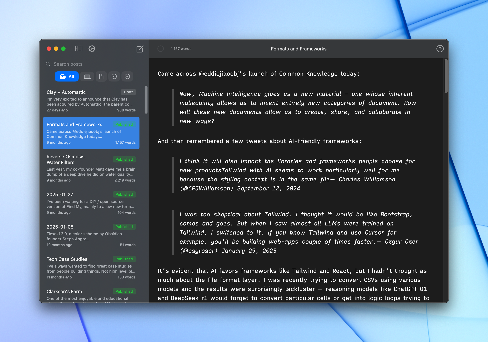
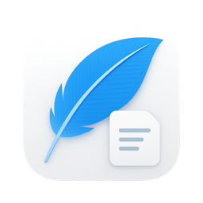

<div align="center">





# Quill

**A beautiful, distraction-free WordPress editor for Mac**

[Download Latest Release (v1.0.2)](https://github.com/zmh/quill-app/releases/latest) • [View All Releases](https://github.com/zmh/quill-app/releases)


</div>

---

## What is Quill?

Quill is a native Mac app that lets you write and publish WordPress blog posts offline. It features a clean interface, Gutenberg block support, and works completely offline with automatic syncing.

## ✨ Key Features

- 📝 **Write Offline** - Full offline support with automatic syncing
- 🎨 **Gutenberg Blocks** - Support for paragraphs, headings, lists, quotes, code, and images
- ⌨️ **Native Experience** - Built with SwiftUI, feels like a true Mac app
- 🔐 **Private & Secure** - No tracking, HTTPS only, credentials in macOS Keychain
- ⚡ **Fast & Lightweight** - Native Swift performance

## 📥 Installation

### Download (Recommended)

**[→ Download Quill v1.0.2](https://github.com/zmh/quill-app/releases/latest)**

1. Download the latest `.dmg` from the [Releases page](https://github.com/zmh/quill-app/releases)
2. Open the `.dmg` and drag Quill to your Applications folder
3. Launch Quill and connect your WordPress site

### Build from Source

Requires Xcode 16+ and macOS 15.5+:

```bash
git clone https://github.com/zmh/quill-app.git
cd quill-app
open Quill/Quill.xcodeproj
```

Then press ⌘R to build and run.

## 🚀 Getting Started

1. Open Quill and go to **Settings → Accounts**
2. Enter your WordPress site URL (must use HTTPS)
3. Create an **Application Password** in your WordPress admin (Users → Profile → Application Passwords)
4. Enter your username and Application Password in Quill
5. Start writing!

## 🔒 Security & Privacy

- **HTTPS Required** - All connections are encrypted
- **No Tracking** - Zero analytics or data collection
- **Keychain Storage** - Your credentials are stored securely in macOS Keychain
- **Local First** - All your content stays on your Mac

## 🛠️ For Developers

See [SECURITY.md](SECURITY.md) for security details and [CONTRIBUTING.md](CONTRIBUTING.md) for contribution guidelines.

Built with SwiftUI and SwiftData. Full architecture details in [CLAUDE.md](CLAUDE.md).

## 📄 License

MIT License - see [LICENSE](LICENSE) for details.

---

<div align="center">

**Independent project, not affiliated with WordPress or Automattic**

[Report an Issue](https://github.com/zmh/quill-app/issues) • [Request a Feature](https://github.com/zmh/quill-app/issues/new)

</div>